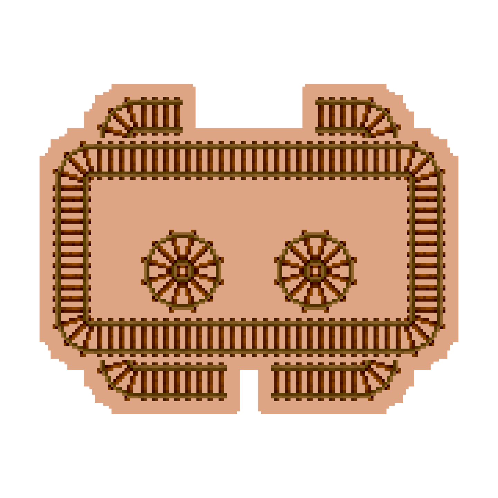

# RustyRails

## About

RustyRails is a simpple responder Discord bot with a few utilities builtin. 
This bot has configurable canned responses, regexes and permissions that can be configured from `config.toml`.  

RustyRails is made to work in conjunction with Minecraft servers using Discord integration, and as such provides the ability to parse roles from a webhooks title with a regex match.  

## Purpose
RustyRails is mainly designed to assist in directing users to resources such by having easily canned responses and regex responses which can automatically answer to common questions. However, this bot also includes a few conversion utilities, like converting timezones, temperatures and Minecraft items to stacks and reversed. More utilities may be added in the future!

## Utilities

### Temperature
The temperature command can convert a given amount of degrees in Celsius or Fahrenheit to the other.  
`!temperature 20c` will return "20 in Celsius is 68 in Fahrenheit.", while  
`!temp 60f` will return "60 in Fahrenheit is 15.56 in Celsius.".  

### Timezone
The timezone command can convert a given time and timezone to a unix timestamp, which will be embedded in Discord to show this time in the users' local timezone. It is also possible to specify a second timezone which it will do a direct conversion to.  
The command can parse various time formats, with meridiens or without and the timezones are case insensitive. This command also generates a link to a table from [time.is](https://time.is) which provides more information.  

`!timezone 8PM Europe/Amsterdam` will show what 8PM is in the timezone `Europe/Amsterdam`, linking to [https://time.is/compare/2000_in_Amsterdam](https://time.is/compare/2000_in_Amsterdam)  


### Minecraft
There are two Minecraft related commands to convert an amount of items to stacks, or an amount of stacks to items.  
The mcstacks command will take a given amount of items and say how many stacks this breaks down into, with the remainder.  
`!mcstacks 128` will return "128 items break down into 2 stacks with 0 items left over"  

The mcitems command does the opposite, and takes an amount of stacks (Optionally with decimals) and returns how many items these stacks consist of.  
`!mcitems 5.5` will return "5.5 stacks break down into 352 items"  

## Configuration
The bot can be configured with a `config.toml` file in the current directory. The default configuration is the following:  

<details><summary>config.toml</summary><p>

###### config.toml

```toml
bot_token = "XXXXXX"
prefix = "!"
trim_regex = ""
command_cooldown = 15
regex_response_cooldown = 45
enabled_utils = ["regex", "mcstacks", "mcitems", "temperature", "timezone"]

[responses]
ping = "Pong!"
pong = "Ping!"

[regex_responses]
"is the bot (?:here|on|alive|working)" = "Nope, definitely not"

[aliases]
ping = ["p", "test"]

[roles.admin]
id = 123456781234567812
webhook_regex = "\\[Admin\\].*"
inherit = "default"
perms = ["admin.reload", "bypass.regex", "bypass.cooldown"]

[roles.default]
id = 0
webhook_regex = ""
inherit = ""
perms = ["cmd.regex", "cmd.mcstacks", "cmd.mcitems", "cmd.temperature", "cmd.timezone"]
```

</p></details>

The bot will automatically generate this configuration file on first start. The configuration file can be reloaded with the `!reload` command if the user has the `admin.reload` permission.  

### Options
| **Option**        | **Description**                | Default |
|:--------------|:-----------------------------------|:--------:|
| `bot_token` |  Needs to be set for the bot to run. This is the bot token obtained from the [Discord Developer Portal](https://discord.com/developers/applications) | `"XXXXXX"` (Replace this!) |
| `prefix` | The prefix for all the bot's commands, this can be any string  | `"!"` |
| `trim_regex` | Anything matching this regex will be trimmed before the message is processed by the bot, this is useful for if any integrations your server has produces messages with junk data | `""` (None) |
| `command_cooldown` | This defines the cooldown for all the commands, while a command is on cooldown, only members of a role with the `bypass.cooldown` permission can use this command. | `15` |
| `regex_response_cooldown` | This is the amount of time the bot will wait before automatically replying to a message with a certain regex match. The regex can still be gotten by using the `!regex` command | `45` |
| `enabled_utils` | This is a list of the bots utilities that are enabled, removing a utility here means it can't be used by anyone | `["regex", "mcstacks", "mcitems", "temperature", "timezone"]` |
| | | |
| **\[responses\]**| | |
| | Under the responses header, a table of commands to canned responses can be defined. Responses are allowed by default, but can be negated with the `-response.<command>` perm | `ping = "Pong!"` | 
| | | |
| **\[regex_responses\]**| | |
| | Under the regex_responses header, a table of regexes to their responses can be defined. Users with the `bypass.regex` permission will not trigger regex responses | `"is the bot (?:here|on|alive|working)" = "Nope, definitely not"` | 
| | | |
| **\[aliases\]**| | |
| | Under the aliases header, a table of aliases for commands can be defined. | `ping = ["p", "test"]` | 
| **\[roles.**<RoleName\>**\]** | | |
| | By defining a header with the name `role.<ROLE>`, you can create a role. A role can give or deny permissions to a command of feature | `[roles.admin]` and `[roles.default]` |
| `id` | The Discord Role ID of this role, if not set this role can still be used by setting it as inherited in other roles that do. | `0` |
| `webhook_regex` | This uses a regex match on a message if it was sent from a webhook to get this role. This can be used to set permissions across a Minecraft (or other game) -> Discord bridge | `""` (None) |
| `inherit` | This makes a role inherit a different role. The bot will recurse through the roles until it finds a match for a permission. Make sure these don't loop! | `""` (None) |
| `perms` | This is a list of permissions the role has. A permission can be negated by prefixing it with a `-` character. | `["cmd.regex", "cmd.mcstacks", "cmd.mcitems", "cmd.temperature", "cmd.timezone"]` |

## Installation
You can get prebuilt binaries from GitHub releases at [this repositories' releases](https://github.com/diademiemi/RustyRails/releases), which are automatically built with GitHub Actions.  
Alternatively, you can compile this project yourself by cloning this repository and running `cargo build --release`. This will produce binaries in `target/release`, or you can run `cargo run --release` to run it directly from cargo.  
